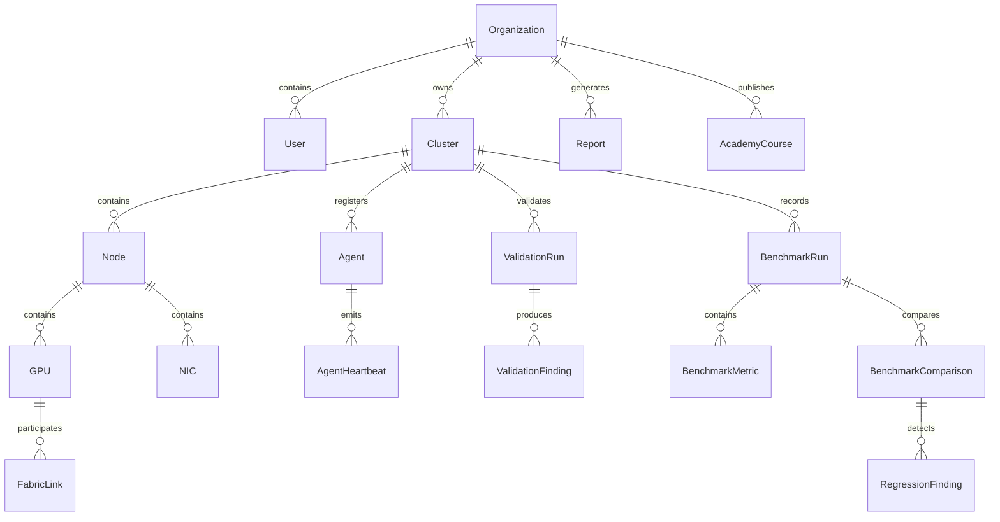

# GPUValidator Data Model V02

## Persistence

The existing repository persists operational artifacts as JSON. V02 adds a durable local JSON platform store using collection names that map directly to Pydantic entities in `src/ai_validator/platform.py`.

## Implemented entity collections

Organization, User, Role, Permission, Cluster, Rack, Node, GPU, NIC, FabricLink, StorageTarget, Scheduler, KubernetesCluster, Agent, AgentHeartbeat, ValidationDefinition, ValidationRun, ValidationStep, ValidationFinding, BenchmarkPackage, BenchmarkRun, BenchmarkResult, BenchmarkMetric, BenchmarkComparison, RegressionFinding, Alert, Incident, Investigation, Conversation, ConversationMessage, EvidenceReference, Report, RemediationPlan, ApprovalRequest, AuditEvent, AcademyCourse, AcademyLesson, AcademyLab, AcademyProgress, SavedInvestigation.

Every operational object includes an immutable id, organization scope where applicable, source, timestamps, status, confidence, evidence references, created_by, updated_by, version, correlation_id, and audit metadata through `PlatformEntity`.

## Migration status

No relational migration framework exists in the current repository. V02 therefore implements schema-first Pydantic models and a JSON store. A future database migration should preserve these collection names and fields.

Status legend: IMPLEMENTED = present in this worktree; PARTIAL = scaffolded or fixture/demo mode; PLANNED = designed but not live; BLOCKED = requires hardware, credentials, or approval.

Public/private evidence boundary: GPU Benchmark Lab remains the public benchmark source. GPUValidator stores compact fixtures, references, checksums, citations, and generated operational records. Private raw artifacts, secrets, GPU UUIDs, internal IPs, and hostnames must be redacted or kept out of product-facing responses.
