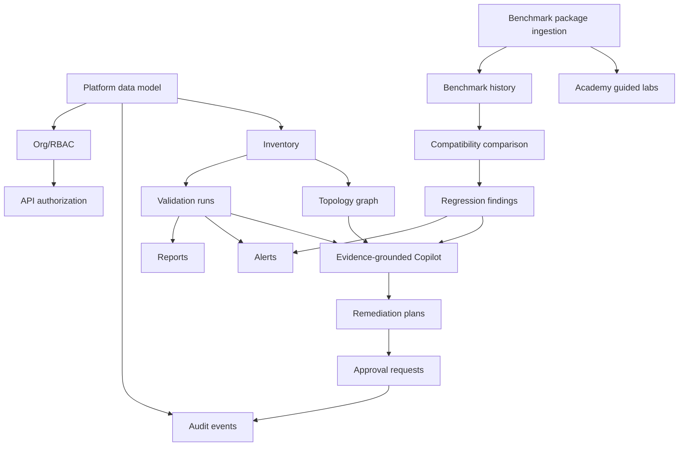

# GPUValidator Feature Dependency Graph V02

Critical path: data model -> RBAC/audit -> inventory/benchmark persistence -> validation/comparison/regression -> UI/Copilot/reports/remediation/Academy.

Status legend: IMPLEMENTED = present in this worktree; PARTIAL = scaffolded or fixture/demo mode; PLANNED = designed but not live; BLOCKED = requires hardware, credentials, or approval.

Public/private evidence boundary: GPU Benchmark Lab remains the public benchmark source. GPUValidator stores compact fixtures, references, checksums, citations, and generated operational records. Private raw artifacts, secrets, GPU UUIDs, internal IPs, and hostnames must be redacted or kept out of product-facing responses.
