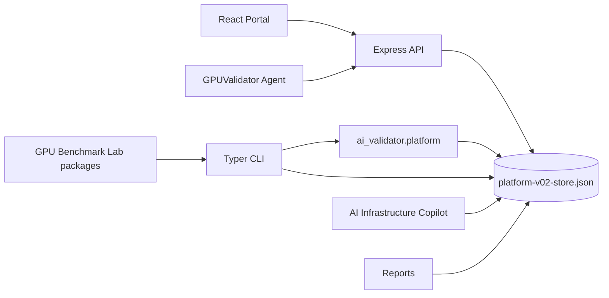

# GPUValidator Platform Architecture V02

## Scope

GPUValidator is the operational product for AI infrastructure inventory, validation, benchmarking, history, comparison, regression detection, topology interpretation, reports, alerts, Academy workflows, and evidence-grounded Copilot investigations. GPU Benchmark Lab remains the public evidence/education source.

## Current architecture

- Frontend: Vite + React + TypeScript in `src/App.tsx`; graphite/neon-green enterprise UI. PARTIAL.
- Backend: Express server in `server.ts` plus Python Typer CLI package `ai_validator`. PARTIAL.
- Persistence: JSON artifact files under `artifacts/`; V02 platform store is `artifacts/platform-v02-store.json`. IMPLEMENTED fixture/local durable store.
- Python services: `ai_validator.platform` defines platform entities, file persistence, RBAC, agents, validation, benchmark comparison/regression, Copilot response contracts, remediation approval, alerts, reports, and Academy fixture flows. IMPLEMENTED fixture mode.
- Agents: outbound/fixture agent lifecycle model with registration, hashed tokens, heartbeat, inventory submit, job claim, and result upload. IMPLEMENTED in Python service tests; HTTP agent endpoints are PLANNED.

## Failure/degraded modes

Missing collectors, missing GPU tooling, unavailable Kubernetes/Slurm/DCGM, and absent live integrations must produce explicit unknown/not-available states instead of failing the whole inventory or validation run.

Status legend: IMPLEMENTED = present in this worktree; PARTIAL = scaffolded or fixture/demo mode; PLANNED = designed but not live; BLOCKED = requires hardware, credentials, or approval.

Public/private evidence boundary: GPU Benchmark Lab remains the public benchmark source. GPUValidator stores compact fixtures, references, checksums, citations, and generated operational records. Private raw artifacts, secrets, GPU UUIDs, internal IPs, and hostnames must be redacted or kept out of product-facing responses.
